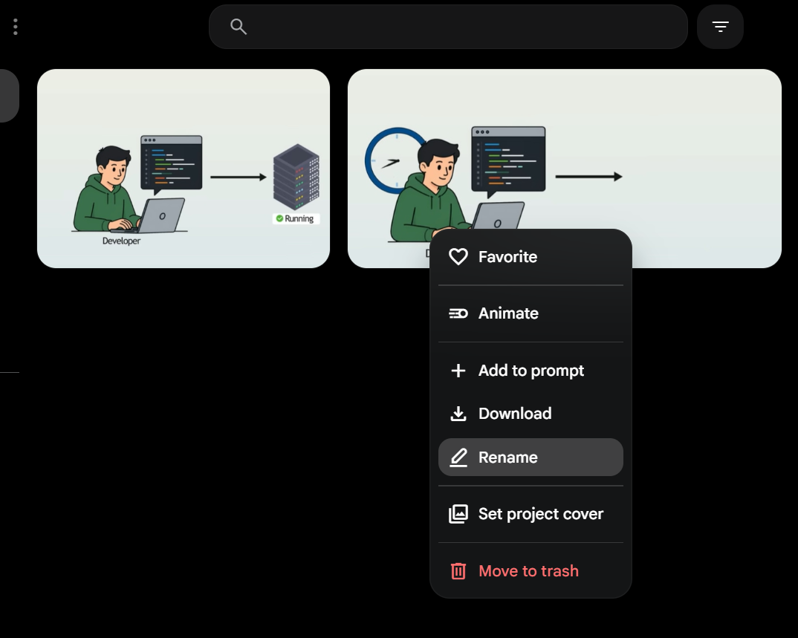
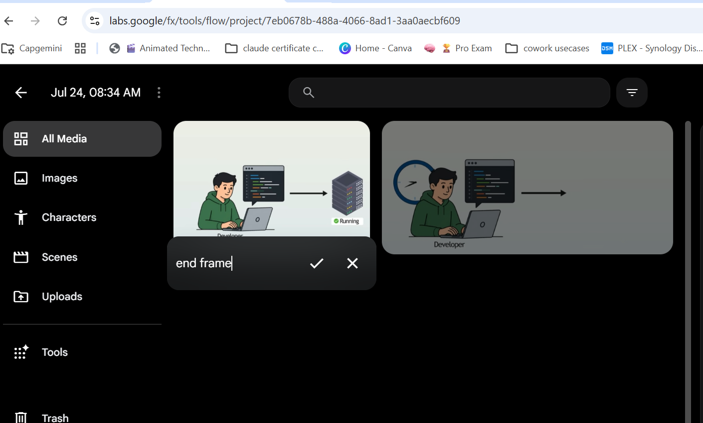

# start-end-frame-interpolation
Create practical tech animations 

Example 

https://youtu.be/ddDJxFnv-qs?t=11

## name the image

## end frame

## prompt 
- use the start frame and end frame to animate > make sure the Developer types and the terminal gets more text with colors and servers running the lights change in the servers

## generate
Would you like to proceed with Veo 3.1 - Lite, or would you prefer to just use the first frame with Omni Flash?

radio_button_checked
Use Veo 3.1 - Lite (Interpolate between frames)

radio_button_unchecked
Use Omni Flash (Animate from start frame only)

## approval
I'm going to generate an 8-second video animating between your two frames using Veo 3.1 - Lite.

Would you like me to kick off this 1 video generation, costing 10 credits? 

